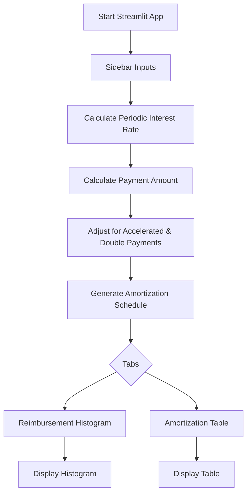

# Mortgage Calculator Streamlit App - Architecture & Plan

## Overview
A fully customizable mortgage calculator built with Streamlit, allowing users to adjust key parameters and visualize their mortgage amortization with interactive charts and tables.

---

## Features
- **Customizable Inputs:**
  - Mortgage Amount
  - Annual Interest Rate
  - Amortization Period (Years)
  - Term (Years)
  - Payment Frequency: Monthly, Bi-Weekly, Weekly, Accelerated Bi-Weekly, Accelerated Weekly
  - Double Payments toggle

- **Calculations:**
  - Payment per period
  - Total number of payments
  - Total payment amount
  - Amortization schedule with principal and interest breakdown

- **Visualizations:**
  - Histogram of principal vs. interest over time
  - Amortization table with payment details

---

## Architecture

### 1. User Interface (Streamlit)
- **Sidebar Inputs:** Collects all mortgage parameters.
- **Main Display:**
  - Payment summary
  - Tabs:
    - **Reimbursement Histogram:** Stacked bar chart of principal vs. interest.
    - **Amortization Table:** Detailed payment breakdown.

### 2. Mortgage Calculation Logic
- Convert annual interest rate to periodic rate based on payment frequency.
- Calculate payment using the annuity formula.
- Adjust for accelerated and double payments.
- Generate amortization schedule iteratively:
  - Calculate interest and principal for each payment.
  - Reduce balance accordingly.
  - Stop when balance reaches zero.

### 3. Visualization
- **Histogram:** Uses matplotlib for stacked bar visualization.
- **Table:** Uses pandas DataFrame with currency formatting.

---

## App Flow Diagram

---

## Summary
This app provides a comprehensive, interactive tool for mortgage planning, enabling users to explore different scenarios and understand their payment structure over time.